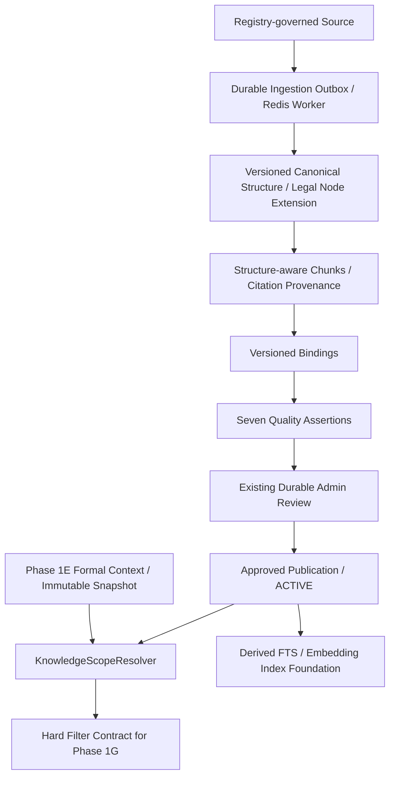

# Phase 1F Knowledge & Scope Design

Phase: **1F — Knowledge Ingestion & Scope Resolver Foundation**.

Tested SHA: `4e7d0d9759c42b2da91a23dea47f2cdea0243449`. Run ID: `36973419700`. Attempt: `1`.
Final evidence Source of Truth: [phase1f_final_remote.json](evidence/phase1f_final_remote.json).
Artifact ID: `11213170166`. Artifact digest: `sha256:be40b7ccc016e51895c067b3779783aa921450505f2fd52b64457ff36db99b03`.

| Empirical assertion | Actual result |
|---|---|
| Full PostgreSQL/runtime pytest | **142 passed / 0 skipped / 0 deselected** |
| Alembic head | **0006_phase1f** |
| Phase 1F schema | **29/29 PASS** |
| Architecture executable checks | **77/77 PASS** |
| Phase 1A runtime/checkpoint/restart/resume/retry | **25/25 PASS** |
| Phase 1B / 1C / 1D / 1E schema regression | **16/16; 20/20; 15/15; 22/22 PASS** |
| Phase 1A–1E full regression | **PASS** |

Above values are independently verified through GitHub Checks measured evidence for the identified CI run; they do not reuse Phase 1E totals. The local full gate at `4e7d0d9759c42b2da91a23dea47f2cdea0243449` is separate corroborating evidence. The linked remote manifest pins the immutable pre-issuance baseline. Later governance commits contain documentation/evidence only and retain the tested implementation.

Known exclusions: Phase 1G retrieval/ranking/reranking/RAG/answer generation, classification, regulation applicability, country rules, risk and compliance paths are excluded. Ingestion currently supports approved canonical structure JSON upload or controlled HTTPS JSON sources; automatic legal PDF/DOCX import, external site crawling, actual model-provider execution and affected-project impact calculation are excluded. Storage/embedding tests use explicit adapters; PostgreSQL and Redis are real. Whitespace token counting is a deterministic foundation measure, not provider tokenizer equivalence. Local PostgreSQL 17.11/Redis 8.0.2 are separately identified from CI PostgreSQL 16/Redis 7.

Authoritative boundary: PostgreSQL canonical knowledge tables; Phase 1C source definitions/collections/bindings and model metadata are reused; Phase 1B RegulatoryStructureNode/EvidenceReference/Citation and durable admin review are reused. Object storage retains original artifacts. Registry, FTS and pgvector are derived projections/indexes. Formal Phase 1E context is the only context input.

The platform separates ingestion/publication from runtime permission scope. No similarity query, ranking, LLM call or legal conclusion occurs in the scope pipeline.

Domain contracts: `domain/knowledge.py`. Application services/ports: `application/knowledge_services.py`, `application/knowledge_ports.py`. PostgreSQL adapters: `infrastructure/persistence/knowledge_models.py`, `knowledge_repositories.py`. Controlled transport/queue: `knowledge_download.py`, `knowledge_worker.py`. API and migration are separate adapters.

Each lifecycle mutation locks the parent document then refreshes the version under row lock. Independent human approval is required; worker credentials cannot approve. A unique partial index enforces one ACTIVE version per document. Publish supersedes the previous ACTIVE version and emits change/diff records. Snapshot scope persists formal context, versions, bindings, indexes and embedding configuration identities; resume uses those historical identities while rechecking current permissions and source revocation.

PASS evidence: complete tests/test_phase1f_postgres.py + tests/test_phase1f_snapshot_scope.py (34 PostgreSQL tests) and tests/test_phase1f_download_chunking.py (26 tests), schema gate and architecture gate. Mandatory Cases A–E are explicit tests.
