# 跨境數據合規智能體 — Phase 0 開發前設計與架構確認 V3.7

> 基線來源：`跨境數據合規智能體_Codex_Master_Specification_V3.7.md` + V3.6 verified implementation contracts + `v3.6-m2d-pass`  
> 文檔角色：Phase 1 Coding 前的 Architecture / Domain / Contract / ER / Workflow Baseline  
> 原則：本文件不以 Demo 為目標，不進行大規模業務代碼實現；只凍結架構、Domain、Contract、資料模型、運行與驗收邊界。

---

## 0. Phase 0 結論與決策狀態

### 0.1 結論

V3.7 在 V3.6 已凍結主架構之上，整合 M2-A～M2-D 已驗證契約，並新增凍結 LLMInvocationPolicy、多 Provider/Model Control Plane、Northbound API 與 Stage 1 Full E2E Contract；完成本文件後可作為 Phase 1 Skeleton / Core / Config / Registry 的完整設計基線。本 Phase 0 將以下內容正式凍結：

1. **唯一默認 Workflow Runtime：LangGraph**，Application 只依賴 `WorkflowRuntimePort`，Domain / Agent / Skill 不直接依賴 LangGraph API。
2. **ONE INTELLIGENCE CORE + MULTIPLE ACCESS CHANNELS**：Web / VS Code / Third-party API 共用同一 Application Use Case、Graph、Agent、Skill、Rule、Knowledge、Review、Audit。
3. **DATA / CONFIG / RULE / PROMPT / KNOWLEDGE / TEMPLATE 與 CODE 分離**；新增 Country / Product / Scenario / Regulation / Rule / Template 原則上不得修改核心 Python / React / Root Graph。
4. **Scope-first Retrieval**：Permission / Jurisdiction / Scenario / Product / Industry / Data Category 先行，Vector Similarity 永遠不能突破 Scope。
5. **Document-first Product Context**：未選產品但有上傳文檔時，先解析文檔再形成 `effective_product_scope`，不得全產品庫檢索。
6. **Party / Legal Responsibility、Classification Scheme、Rule DSL、Evidence、Path、Snapshot、Review 均為正式 Domain**，不能只用 Prompt 或自由文本承載。
7. **Candidate Path → Risk → Recommendation → Final Path** 為固定依賴方向，禁止形成 Risk ↔ Path 循環。
8. **Production-ready**：同一 Codebase 支持 Local / Cloud / Restricted Network；PostgreSQL durable checkpoint、Docker Compose、Kubernetes/Helm baseline、Observability、Backup/Restore、Migration、Webhook、OAuth 均在架構內。
9. **Stage 1 Canonical Result + Visualization Contract**：`AnalysisStageResult`、`Stage1ComplianceResult`、`LegalBasisItem`、`ComplianceVisualizationResult` 為正式後端 Contract；Workflow Stepper 必須映射真實 LangGraph 狀態，Data Transfer 與 Compliance Path 必須是可交互結構化視圖，KPI 由 Backend 聚合，Data Item 可回溯 Source / Legal Basis / Evidence。

### 0.2 Phase 0 Gate 狀態

| Gate | 狀態 | Phase 0 判定 |
|---|---|---|
| Gate A — Architecture & Domain | PASS | Domain、API、Party/Role、Classification、Rule DSL、Path、AnalysisStageResult、Stage1ComplianceResult、LegalBasisItem、Visualization Interaction Contract 已凍結 |
| Gate B — Research Capability & Knowledge | PASS | Scope、Knowledge、RAG、Wiki、KG、Country Capability、Monitoring、Vision 邊界已凍結 |
| Gate C — Production & Integration | PASS（Design） | H5/Embed、Mandatory Stage 1 Result Page、Visualization Export、VS Code、API、OAuth、Redaction、Local/Cloud、Ops/E2E contract 已定義；實際運行證據留待實作階段測試 |
| Gate D — LangGraph Runtime | PASS（Design） | Port/Adapter、Typed State、Checkpoint、Interrupt/Resume、Retry/Timeout、Loop Guard、Retention 已定義；實際 restart/resume evidence 留待實作階段 |
| Hard-code Review | PASS（Design） | 可變業務內容均要求 metadata/config/rule/registry/version 驅動 |
| Architecture Conflict Review | PASS with required normalizations | 見 Part 44；無需變更 V3.6 主架構，但需在 Phase 1 Skeleton 前完成命名/Source-of-Truth 消歧 |

> **Phase 1 允許範圍**：只做 Skeleton / Core / Config / Registry / Contracts，不得在 Phase 1 偷跑 Country-specific、Product-specific、Regulation-specific 業務實作。

---


### 0.3 V3.7 Implementation-proven Consolidation

V3.7 以 `efda0955342de8d1ea36aa0f754d63c9b421fec8` / `v3.6-m2d-pass` / Alembic `0015_m2d_review_governance` 作為已驗證 implementation reference。這不是把 repository 當規格的唯一來源，而是用實證收口 V3.6 已有設計中已完成的部分。

已提升為設計 baseline 的 implementation-proven invariants：

- Structured Intake + real Document input coexistence；
- DocumentVersion / ParseRun / SourceTrace → formal context；
- stable canonical identity + immutable versioned formal state + exact Snapshot pins；
- CrossBorderAssessment formal owner；
- RegulatoryDocumentRequirement formal owner；
- `FinalPath Status ≠ Cross-border Legal Status`；
- RequiredDocument ≠ automatic Stage 2 generation；
- ReviewTask / ReviewDecision governed HITL；
- same-snapshot resume 僅適用於不改 formal input 的 review；
- input-changing correction → successor version/snapshot/workflow；
- historical result immutability。

新增 V3.7 設計口徑：

```text
RAG-FIRST
RULE-FIRST
EVIDENCE-FIRST
LLM-WHEN-NEEDED
```

LLM 是 Document Understanding / Knowledge Gap Assistance / Explanation / Stage2 Generation-Review 的受控增強能力，不是 Formal Legal Decision Authority。

# Part 1 — Requirements Summary

系統定位為「面向境外實際項目的企業級跨境數據合規分析、合規路徑推薦及實施支撐平台」。核心輸入包括 Project、Document、Structured Input、Data Item、Data Flow、Jurisdiction、Product Context；核心輸出包括 Classification、Applicable Regulation、Obligation、Candidate/Final Compliance Path、Risk、Required Document、Evidence、`AnalysisStageResult`、`Stage1ComplianceResult`、`LegalBasisItem`、Visualization、Review 與 Audit。

非功能性要求：

- 多租戶、組織/部門/項目級權限隔離；
- 全流程版本化、Snapshot 化、可追溯；
- Web / VS Code / API 結果 Domain 一致；
- 長任務可異步、可中斷、可恢復、可取消、可重試；
- Local / Private / Cloud / Restricted Network 使用同一核心 Codebase；
- 知識新增、法規更新、產品新增、模板更新均不要求核心代碼變更；
- AI 只在受控邊界工作，正式規則、風險分數、統計、Required Document 不由 LLM 自由生成；
- Stage 1 不能退化為文字報告 + 表格，必須同時有 Workflow Stepper、KPI、Data Transfer、Risk、Compliance Path、Data Item Table、Evidence/Legal Basis；
- 正式 Visualization 只能由 Backend Structured Result → VisualizationAssembler 生成，禁止從 LLM Narrative 反解析。

# Part 2 — Assumptions / Configurable Decisions / Open Questions

## 2.1 已凍結決策

- Backend：Python 3.11+ / FastAPI / Pydantic v2 / SQLAlchemy 2.x / Alembic。
- Workflow：LangGraph + `langgraph-checkpoint-postgres`，Production 使用 PostgreSQL durable checkpointer。
- Primary DB：PostgreSQL；首期 Vector：pgvector；Cache/Lock：Redis；Object：S3-compatible。
- Frontend：React + TypeScript + H5；Theme 使用 Design Token。
- Queue Framework：**不在 Domain 鎖死**，由 `TaskQueuePort` Adapter 化；Phase 1 可先選 ARQ / Dramatiq / Celery 之一。
- Full-text / Graph 專用引擎：首期可不引入，保留 Adapter。

## 2.2 可配置決策

- 模型 Provider、Embedding/Rerank Provider、OCR Provider、Translation Provider；
- Risk / Confidence threshold；
- Retrieval top-k / weights / rerank；
- Upload size、worker concurrency、SLO；
- Checkpoint retention、legal hold、purge policy；
- API quota / rate limit；
- Feature flags；
- Country Capability / Rule Pack / Knowledge Collection / Template Scope。

## 2.3 不阻塞 Phase 1 的 Open Questions

以下不應以 Hard Code 解決，而應保留配置位：

- 正式企業 SSO / IdP 型號；
- 最終 Queue Framework；
- 是否首期啟用 OpenSearch / 專用 Graph DB；
- OCR / Vision / Model 供應商；
- 企業 API Gateway / Secret Manager；
- 具體 SLO 數值與容量上限。

---

# Part 3 — 8-layer System Architecture

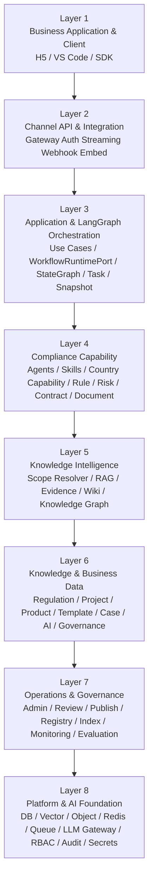

設計規則：上層只能依賴下層公開 Contract；不得跨層直接取得 Provider SDK / ORM Session / Vector Client。

# Part 4 — Module Boundary & Dependency Graph

```mermaid
flowchart LR
  Client --> Channel[Channel / API]
  Channel --> App[Application Use Case]
  App --> Port[WorkflowRuntimePort]
  Port --> LG[LangGraphWorkflowRuntimeAdapter]
  LG --> Agent
  Agent --> Skill[Skill / Domain Service]
  Skill --> Services[Rule / Risk / Knowledge / Document Services]
  Services --> Repo[Repository / Adapter]
  Repo --> Infra[DB / Vector / LLM / Storage]
```

禁止反向依賴；尤其：

- Domain 不 import LangGraph；
- Agent 不 import ORM / pgvector / Provider SDK；
- Skill 不自行選 Model Provider；
- RuleEngine / KnowledgeService 不調 Agent；
- Frontend / Visualization 不重做法律判斷。

# Part 5 — Multi-channel Architecture

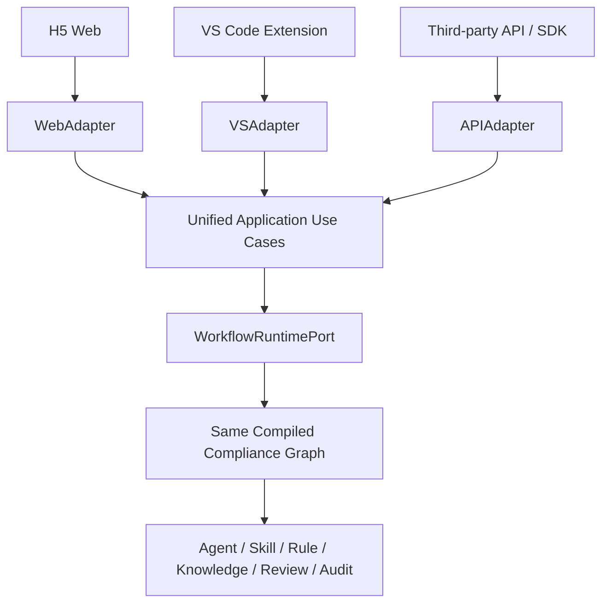

渠道只允許差異：Authentication、Input Adaptation、Streaming、Presentation、Client Interaction。

# Part 6 — HTML5 Frontend / Embed Architecture

前端模式：`FULL / EMBED / READONLY / REVIEW / VISUALIZATION_ONLY`。同一 Feature Component 在不同 shell 下復用。

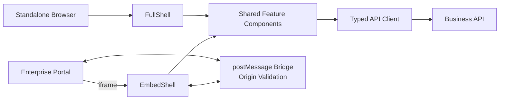

Embed Contract：Allowed Origins、CSP / `frame-ancestors`、postMessage origin check、no long-lived token in URL。事件至少包括 `PROJECT_LOADED / ANALYSIS_STARTED / REVIEW_REQUIRED / ANALYSIS_COMPLETED / DOCUMENT_GENERATED / NAVIGATION_CHANGED / CLOSE_REQUESTED`。

# Part 7 — Frontend Information Architecture

主導航：工作台、新建分析、我的項目/任務、法規知識庫、國別知識、合同與模板中心、合同智能審核、人工覆核、知識運營、運維管理、系統設置。

核心頁面：

- Project Workspace：Overview / Document / Data Inventory / Data Flow / Jurisdiction / Result / Path / Evidence / Visualization；
- Analysis Result Page（強制）：Workflow Stepper / KPI Cards / Data Transfer Map-Route-Topology / Risk Visualization / Compliance Path Timeline-Flow / Data Item Compliance Table / Evidence & Legal Basis Drawer；
- Review Center：Review Queue / Evidence / Decision / Impact Preview；
- Knowledge Operations：Source / Parse / Review / Publish / Reindex / Version Diff；
- Admin Metadata：Jurisdiction / Scenario / Product Taxonomy / Classification / Rule / Prompt / Model / Template；
- Operations：Tasks / Failed Jobs / Checkpoints / Webhooks / Health / Audit。

前端所有 metadata options 通過 Metadata API；不得在 React 中固化 Country/Product/Scenario/Rule 枚舉。

# Part 8 — Backend Service Architecture

核心服務：

- `ProjectService` / `ProjectIntakeService`
- `DocumentIntelligenceService`
- `BusinessFactService`
- `ProductContextService`
- `DataInventoryService`
- `DataFlowService`
- `JurisdictionService`
- `KnowledgeScopeResolver`
- `KnowledgeService`
- `RuleEngine` + `RuleExpressionEngine`
- `RiskEngine`
- `CompliancePathService`
- `EvidenceService` / `EvidenceArbitrationService`
- `ReviewService`
- `TemplateService` / `DocumentGenerationService`
- `ContractIntelligenceService`
- `VisualizationAssembler`
- `ModelUsagePolicyService` / `DataRedactionService` / `LLMGateway`
- `SnapshotService` / `AuditService`
- `CapabilityExecutionService`
- `TaskService` / `RegistrySyncService`

服務間以 Typed DTO / IDs 交互，不傳 ORM Entity。

# Part 9 — Full Project Directory Tree

Canonical tree 以 Master V3.6 為準，Phase 0 做兩項收口：

1. `knowledge/wiki/` 重複目錄合併為單一路徑；
2. `state/` 依 Typed Slice 名稱統一，避免 `product/data/flow` 含混命名。

建議核心骨架：

```text
backend/app/
  api/{business,metadata,visualization,agents,skills,knowledge,contracts,admin,external}
  channels/{web,vscode,external_api,common}
  application/{commands,queries,dto,use_cases,presenters}
  domain/{projects,parties,documents,facts,products,data_items,data_flows,jurisdictions,regulations,classification,compliance,risks,knowledge,contracts,templates,reviews,visualization,audit}
  services/
  repositories/
  document_intelligence/{parsers,layout,vision,diagrams,tables,facts,products,data_items,data_flow}
  agents/{orchestration,vertical,compliance,evidence,documents,review}
  skills/{generic,country,product,knowledge,compliance,contracts,documents}
  workflows/ports/
  workflows/langgraph/{runtime,graphs,subgraphs,nodes,routers,persistence,streaming}
  state/{request,project,document,business_fact,product_context,data_inventory,data_flow,jurisdiction,scope,knowledge,classification,obligation,candidate_path,risk,recommendation,final_path,document_requirement,evidence,review,visualization,runtime}
  scope/{permission,jurisdiction,scenario,product,industry,data_category,knowledge}
  rules/{engine,dsl,parser,ast,expression,evaluators,tests}
  rag/{routing,retrieval,filters,reranking,validation}
  knowledge/{facade,regulation,monitoring,wiki,country,product,case,templates,research,evidence,ingestion,graph,governance}
  llm/{gateway,providers,router,policies,redaction,vision,usage}
  registries/{jurisdictions,scenarios,products,agents,vertical_agents,skills,models,prompts,templates,rules}
  snapshots/ reviews/ visualization/ reports/ document_generation/ events/ audit/ integrations/ operations/ evaluation/
frontend/src/{app,channels,features,embed,design-system,services,stores,hooks,types,config}
clients/vscode-extension/
packages/{compliance-embed-sdk,compliance-types}
sdks/{python,typescript}
configs/ rules/ prompts/ templates/ knowledge_seed/ migrations/ tests/ scripts/ docker/ deploy/ observability/ docs/
```

# Part 10 — Domain Model

主聚合與關係：

- `Tenant → Organization → User / Role / Permission`
- `Project → ProjectVersion → AnalysisSnapshot → WorkflowRun`
- `Project → ProjectParty → LegalEntity → PartyRoleAssignment`
- `Project → Document → DocumentVersion → ParseRun → BusinessFact`
- `Project → DataItem ↔ DataFlowEdge → DataFlowNode`
- `DataItem → ClassificationResult → ClassificationScheme / Category / Level`
- `Jurisdiction → Regulation → RegulationVersion → RegulatoryStructureNode`
- `KnowledgeDocument → KnowledgeVersion → KnowledgeChunk → Binding / Evidence / Citation`
- `RuleVersion → RuleHit → ComplianceRequirement → CandidatePath → Risk → Recommendation → FinalPath`
- `FinalPath → DocumentRequirement → RegulatoryTemplate / EnterpriseTemplateRecommendation`
- `ReviewTask → ReviewDecision → DependencyInvalidation → Partial Re-run`

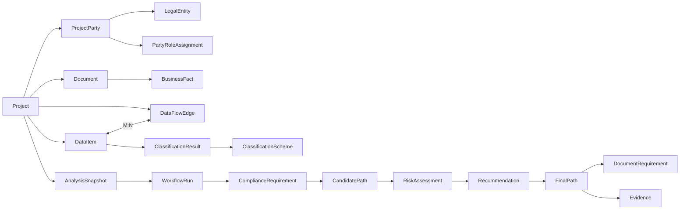

# Part 11 — Pydantic / Typed Schema

Phase 0 固定 schema family，不固定所有欄位的最終 API spelling。核心 DTO：

```text
ProjectIntakeContext
AnalysisRequest
AnalysisContext
ProductScope / ProductContextResolution
KnowledgeScope
DataItemDTO / DataFlowNodeDTO / DataFlowEdgeDTO
ProjectPartyDTO / PartyRoleAssignmentDTO
ClassificationResultDTO
RuleFactContext / RuleHitDTO
ComplianceObligationDTO
CandidateCompliancePathDTO
RiskAssessmentDTO
ComplianceRecommendationDTO
FinalCompliancePathDTO
EvidenceReferenceDTO
ReviewTaskDTO / ReviewDecisionDTO
AnalysisStageResultDTO
Stage1ComplianceResultDTO
LegalBasisItemDTO
ComplianceVisualizationResultDTO
WorkflowStageViewDTO / KPIVisualizationItemDTO / VisualizationNodeDTO / VisualizationEdgeDTO / VisualizationPathStepDTO / RiskVisualizationItemDTO
WorkflowEventDTO
CapabilityExecutionRequestDTO
StandardErrorDTO
```

規則：所有跨模組 DTO 使用 Pydantic v2 / dataclass-like typed contract；API DTO ≠ ORM Model；Graph State DTO ≠ Persistence Entity。

# Part 12 — Database ER Model

核心 logical schema：`identity / projects / interaction / documents / facts / products / data_inventory / jurisdiction / regulation / knowledge / cases / compliance / risk / path / templates / generation / contracts / evidence / workflow / langgraph_runtime / review / audit / metadata / operations / integration / governance_models / configuration`。

## 12.1 Core PK/FK/Constraint Baseline

| Table | PK | 主要 FK | 核心 Unique / Constraint | 重要 Index |
|---|---|---|---|---|
| projects.projects | project_id UUID | tenant_id, organization_id | `(tenant_id, project_code)` | tenant_id, organization_id, status |
| projects.project_parties | project_party_id | project_id, legal_entity_id | `(project_id, legal_entity_id, display_name)` soft-unique | project_id, legal_entity_id |
| projects.party_role_assignments | assignment_id | project_party_id, jurisdiction_id, flow_id, data_item_id | role/effective range validation | project_party_id, role_code, jurisdiction_id |
| documents.documents | document_id | project_id, tenant_id | source hash/version constraints | project_id, document_type, status |
| data_inventory.data_items | data_item_id | project_id | source locator uniqueness where applicable | project_id, product_id, category |
| data_inventory.data_flow_edges | flow_id | project_id, source_node_id, destination_node_id | source != destination where policy requires | project_id, source/destination jurisdiction |
| compliance.classification_results | classification_result_id | data_item_id/group, scheme_id, level_id, jurisdiction_id | `(object, jurisdiction, scheme, version)` | jurisdiction_id, scheme_id, level_id |
| regulation.regulation_versions | regulation_version_id | regulation_id | `(regulation_id, version)` | effective_date, status |
| knowledge.knowledge_versions | knowledge_version_id | knowledge_document_id | `(knowledge_document_id, version)` | status, effective_date |
| knowledge.knowledge_chunks | chunk_id | knowledge_version_id, structure_node_id | `(knowledge_version_id, sequence)` | tenant/status/jurisdiction/product/scenario + vector |
| compliance.rule_versions | rule_version_id | rule_id | `(rule_id, version)` | jurisdiction/scenario/status/effective_date |
| path.compliance_paths | path_id | project_id, analysis_snapshot_id | immutable version uniqueness | project_id, status, version |
| workflow.workflow_runs | workflow_run_id | project_id, analysis_snapshot_id | thread id uniqueness | status, project_id, created_at |
| review.review_tasks | review_id | workflow_run_id | status transition constraint | required_role, status, created_at |
| integration.api_clients | api_client_id | tenant_id | client identifier unique per tenant | tenant_id, status |
| integration.webhook_subscriptions | webhook_subscription_id | api_client_id | endpoint/event uniqueness policy | api_client_id, status |

所有核心業務表含 `tenant_id`；版本化資料採 Immutable Version + Active Pointer / Status；Delete 默認 Restrict，只有明確 child lifecycle 才 Cascade。

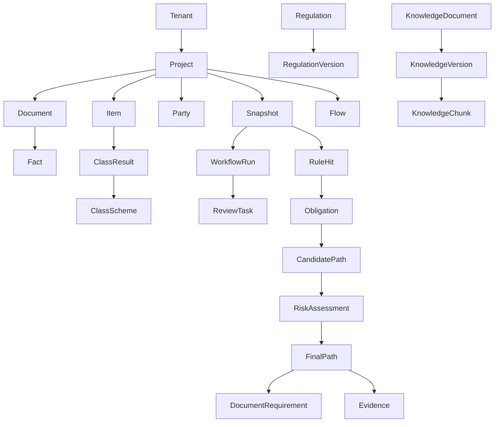

# Part 13 — Agent Specification

Agent 僅做：Task Understanding、Skill Orchestration、Next-step Decision。核心 Agents：Orchestrator、DocumentIntelligence、BusinessFact、ProductContext、DataInventory、DataFlow、Jurisdiction、VerticalAgentRouter、CountryRouter、DataClassification、RegulationApplicability、Localization、Responsibility、ComplianceObligation、CandidatePath、RiskAssessment、ComplianceRecommendation、CompliancePath、Evidence/Arbitration、TemplateRecommendation、ContractIntelligence/Review、DocumentAutoFill/Document、Report、Review。`HumanReviewNode` 屬 Workflow Node，不進 Agent Registry。

每個 Agent Contract：`agent_id / version / typed_input / typed_output / allowed_skills / required_scope / model_policy / exposure_policy / timeout / audit_category`。

# Part 14 — Skill Specification

Skill 是單一、可重用、Typed、盡量 Stateless 的能力單元。Skill 不查 ORM、不自行選 Provider、不直接決定 tenant scope。

分類：Document/Context、Data、Compliance、Risk/Path、Evidence、Document/Contract。新增具體 SCC/TIA/DPIA 類型**不能**新增固定 Python Skill；由通用 Regulatory Requirement Skills + Metadata/Rule/Template 驅動。

# Part 15 — Vertical Agent Framework

Vertical Agent 代表跨領域合規專業維度，而非 Country 分支。Registry 驅動：

- CrossBorderDataComplianceAgent
- CrossBorderComputeComplianceAgent
- AIServiceComplianceAgent
- OverseasAccessAccelerationComplianceAgent
- future agents via registry

新增 Vertical Agent：允許新增 Plugin/Implementation + Registry，但不能修改 Root Graph 主流程；Graph 只路由至 `vertical_agent_id`。

# Part 16 — CountryComplianceSkill / Country Capability Framework

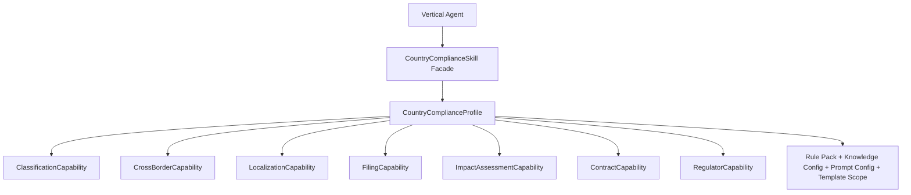

`CountryComplianceSkill` 只暴露通用 Facade 方法；不存在 `if country == X`。Capability 缺失返回 `NOT_APPLICABLE` 或 `CAPABILITY_NOT_CONFIGURED`，由流程決定 Generic Compliance + Review。

# Part 16A — ProjectParty / LegalEntity / PartyRole Domain

`LegalEntity` 描述法律實體；`ProjectParty` 描述該實體在某 Project 的參與；`PartyRoleAssignment` 描述其在 Jurisdiction / Flow / DataItem / Time Window 下的角色。

角色值由 Metadata Registry 管理，至少支持 Controller、Processor、Joint Controller、Exporter、Importer、Recipient、Subprocessor、Service Provider、Regulated Entity、Data Owner、Contract Party、Other。

DataFlow / Contract / CompliancePathStep / Filing 均通過 Link Entity 關聯責任主體。`ResponsibilityAgent` 只能消費結構化 Party/Role + Evidence。

# Part 16B — ClassificationScheme / Level / Result Model

Classification 不是一個 global enum。模型：

- `ClassificationScheme(jurisdiction, industry, regulation_versions, effective range, version)`
- `ClassificationCategory(tree)`
- `ClassificationLevel(sequence, severity, criteria_reference)`
- `ClassificationResult(project, data item/group, jurisdiction, scheme, categories, level, rule_hits, evidence, confidence, review_status, version)`

同一 Data Item 可在不同 Jurisdiction 下存在不同結果。

# Part 17 — Document Intelligence Design

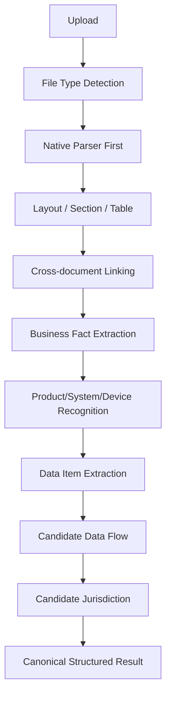

Document Intelligence 只做理解，不做法律判斷。所有輸出保留 source document/page/section/table/row/original text。

# Part 17A — Multimodal / Diagram / Vision Document Understanding

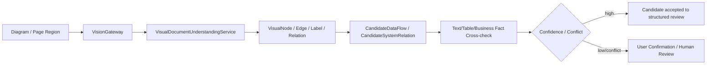

OCR 只提文字；箭頭、節點、關係由 Vision/Diagram capability 處理。每個視覺結論保存 page、bbox、region、evidence、confidence；不能直接升格為法律 Fact。

# Part 18 — Product Context Resolution

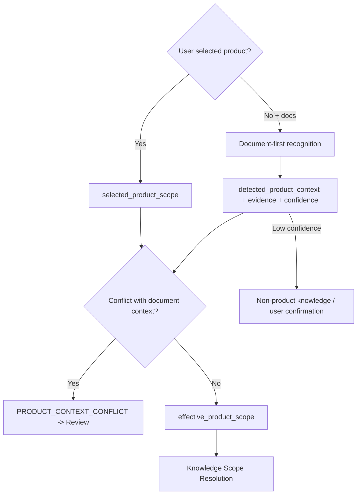

Multi-product：Project 可多 Scope；DataItem/DataFlow 綁最小必要 Scope；Retrieval 不合併成無邊界產品池。

# Part 19 — Knowledge Scope Resolver

Resolver family：Permission / Jurisdiction / Scenario / Product / Industry / DataCategory → `KnowledgeScopeResolver`。

Scope Resolver 回答「可以查什麼」；KnowledgeService 回答「在允許範圍找到什麼」。二者不能合併。

# Part 20 — Knowledge Architecture

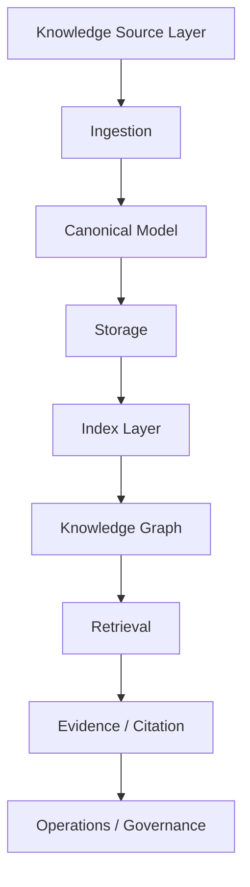

Canonical Model：KnowledgeDocument / Version / StructureNode / Chunk / Binding / EvidenceReference / Citation。Parser-specific object 不得直接供 Agent 使用。

# Part 20A — Knowledge Storage / Index Architecture

- PostgreSQL：metadata/version/binding/permission/status/review/relationships/citation/config/domain；
- Object Storage：原始文件、原始合同、附件、生成文件、必要解析中間產物；
- pgvector：首期 embedding index；
- PostgreSQL FTS：首期 lexical index；
- Graph Tables：MVP KG；後續 `KnowledgeGraphRepository` 可換專用 Graph DB；
- Redis：cache/lock/short-lived data，不作知識 Source of Truth。

索引必須先納入 tenant/permission/status/effective-date/product/jurisdiction/scenario/language filter，再做 vector top-k。

# Part 20B — Regulation Document Intelligence / Multiformat / Multilingual Parsing

Parser matrix：

| 格式 | Primary | Fallback | 關鍵輸出 |
|---|---|---|---|
| Text PDF | PyMuPDF / pypdf | OCR only when text layer unusable | page, block, source anchor |
| Scanned PDF | page image | OCR adapter | OCR confidence + page provenance |
| DOCX | python-docx | conversion adapter | paragraph/table/heading |
| XLSX | openpyxl | none | sheet/cell/table range |
| PPTX | python-pptx | image/vision for diagrams | slide/object/bbox |
| HTML/XML | lxml/BeautifulSoup | controlled text fallback | DOM/source anchor |
| TXT/MD/JSON | native | encoding normalization | line/key path |
| Image | Vision + OCR | provider-specific | bbox / relation / confidence |

多語言：Language Detection → Unicode/Encoding normalization → structure segmentation → original preservation → optional translation → original/translation alignment → review → chunk/index。Evidence 顯示優先順序：官方原文 > 官方翻譯 > 人工覆核翻譯 > 機器翻譯。

# Part 20C — Database Architecture / ER / Index / Constraint Design

資料庫原則：

- UUID 或企業標準 distributed ID；
- tenant key mandatory on business tables；
- immutable version tables；
- JSONB 只用於 Config / extensible metadata / raw structured AI output，不承載核心 relationship；
- FK 默認 `RESTRICT`，避免誤刪法律/審計鏈；
- logical delete + archive + legal hold + physical purge 分離；
- Alembic 管理 migration；
- PostgreSQL backup + PITR（prod recommended）+ object versioning + restore test。

# Part 20D — Technology Stack / Python Dependency Matrix / pyproject.toml Baseline

| Group | Package | 狀態 | 用途 | Adapter 可替換 | Heavy |
|---|---|---|---|---|---|
| core | fastapi, uvicorn, pydantic, pydantic-settings | Required | API/schema/config | 部分 | No |
| db | sqlalchemy, alembic, psycopg/asyncpg, pgvector | Required | persistence | Repository 隔離 | No |
| workflow | langgraph, langgraph-checkpoint-postgres | Required | workflow/checkpoint | Port 隔離 | No |
| http | httpx, tenacity | Required | outbound/retry | Yes | No |
| cache | redis | Required | cache/lock/queue support | Yes | No |
| security | authlib, cryptography, JWT lib | Required | OIDC/OAuth/crypto | Yes | No |
| observability | structlog, opentelemetry-* | Recommended | logs/traces/metrics | Yes | No |
| document | pymupdf, pypdf, python-docx, openpyxl, python-pptx, lxml, beautifulsoup4, Pillow | Required/Recommended | parsing | Parser registry | Medium |
| language | charset-normalizer, regex, lingua-* | Recommended | normalization/detection | Yes | No |
| local-ml | sentence-transformers, transformers, torch | Optional | local embedding/rerank | Yes | Yes |
| ocr | PaddleOCR/Tesseract/Cloud SDK | Optional/provider | OCR fallback | OCRService | Yes |
| llm | openai/anthropic/google-genai | Provider-specific | provider adapter | Yes | Medium |
| test | pytest, pytest-asyncio, hypothesis, testcontainers | Required dev/test | testing | N/A | Medium |
| dev | ruff, mypy, pre-commit, bandit | Required dev | quality/security | N/A | No |

`pyproject.toml` 建議 groups：`core, workflow, document, llm, search, ocr, test, dev`。精確版本在 Phase 1 啟動時對當時 stable version 做 compatibility smoke test 後 lock；不在 Domain code 寫版本條件。

---

# Part 21 — RAG Architecture

RAG 採 **Scope-first + Hybrid Retrieval + Evidence-first**。正式順序固定為：Permission → Jurisdiction / Product / Scenario / Industry / Data Category Scope → Metadata Hard Filter → Lexical + Vector → Hybrid Merge → Rerank → Scope Validation → Evidence Pack。

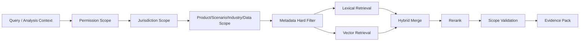

核心 Contract：

- `KnowledgeRetrievalRequest`：query、analysis_snapshot_id、knowledge_scope、retrieval_policy_id、language_strategy、requested_evidence_types；
- `KnowledgeCandidate`：knowledge_version_id、chunk_id、score components、binding、permission、effective range；
- `EvidencePack`：evidence IDs、source priority、citation locator、scope proof、validation status；
- `KnowledgeScopeValidationResult`：allowed / dropped / violation codes。

**強制規則**：

1. `PRODUCT_SPECIFIC` knowledge 在 vector search 前已排除不相關產品；
2. Retriever 不能靠 LLM post-filter 代替 hard filter；
3. `top_k / lexical_weight / vector_weight / rerank` 來自 `KnowledgeRetrievalPolicy`；
4. Cross-language retrieval 可用多語 embedding / query translation，但正式 Evidence 優先官方原文；
5. `KNOWLEDGE_SCOPE_VIOLATION` 必須 drop + audit，不可偷偷繼續 reasoning；
6. RAG 回傳 Evidence，而不是直接製造法律結論。

# Part 22 — LLM Wiki

LLM Wiki 是導航 / 解釋層，不是 authoritative legal source。

生命週期：

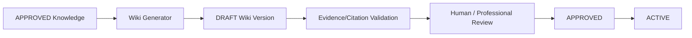

Domain：`LLMWikiPage / LLMWikiVersion / WikiSourceBinding / WikiCitation / WikiReview / WikiPublishRecord`。

每個 Wiki Version 固定 source knowledge versions、evidence IDs、prompt version、model config version、review/approval。Wiki 只能用於 Knowledge Navigation、Summary、Contextual Explanation、Query Assistance；正式 Legal Basis 必須回溯 Regulation / Guidance / Approved Evidence。

# Part 23 — Knowledge Graph

Knowledge Graph 採 **provenance-first graph**。核心關係：

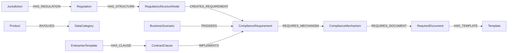

MVP 可用 PostgreSQL graph tables；所有 Graph Node / Edge 綁 `source_knowledge_version_id / source_evidence_id / jurisdiction / effective_from-to / confidence / status / version / reviewed_by`。Embedding 相似度只能產生 candidate relation，不能自動升格為正式法律關係。

# Part 23A — Knowledge Graph Provenance / Version / Evidence Governance

Graph 更新遵循：Knowledge Version Publish → affected nodes/edges candidate update → provenance validation → reviewer approval（法律關係需要時）→ active graph version。對法規版本變更，保留舊 edge 的 effective interval，不覆蓋歷史。

Graph query 必須接受 `analysis_as_of_date + analysis_snapshot_id + scope`，保證歷史分析可重現。Graph Repository 是 Port；Domain 不依賴 Neo4j / SQL graph 具體 SDK。

# Part 24 — Rule Engine

`ComplianceRule` 是版本化 Domain：jurisdiction / industry / scenario / data category / conditions / actions / severity / priority / legal_basis / evidence_required / effective range / status。

Rule Engine 只讀 `Typed RuleFactContext`，不得直接讀 DB / Vector / LLM。Rule 輸出 `RuleHit`，供 Classification、Obligation、Required Document、Risk 等 Domain 消費。

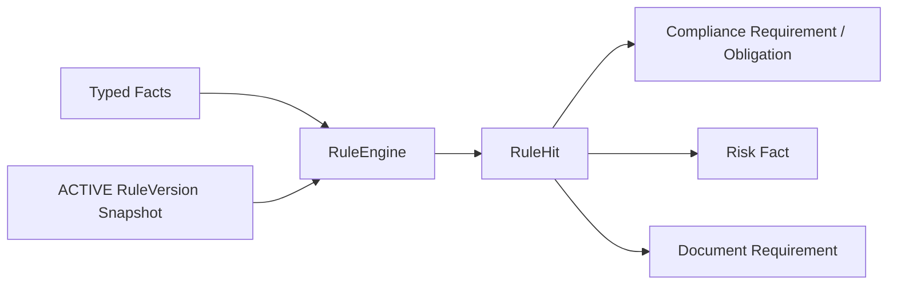

# Part 24A — Safe Rule DSL / AST / Rule Test / Publish Gate

V3.6 baseline 採 **受控 Typed Rule AST v1**，可由 CEL-like / JSON-Logic-like syntax adapter 解析，但 runtime 只執行 validated AST。

允許 operator 範圍示意：`and/or/not/eq/ne/in/contains/gt/gte/lt/lte/exists/date_before/date_after/any/all`；禁止 function import、attribute reflection、shell、network、arbitrary code。

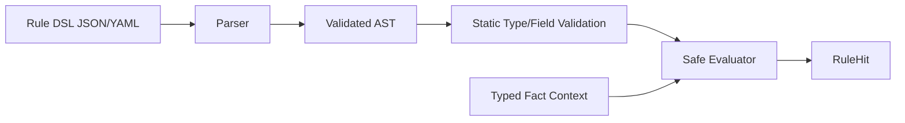

Publish Gate：Schema Validation → Static Validation → Rule Unit Tests → Conflict/Priority Validation → Reviewer Approval → Publish。

`RuleTestCase` 必須記錄 input facts、expected match/actions/severity/evidence requirement。任何未通過 Test 的 RuleVersion 不得 ACTIVE。

# Part 25 — Risk Engine

Risk Engine 與 Legal Obligation 分離。正式 Risk Score / Band 由結構化 policy / rule 計算；LLM 只做 explanation / summary / recommendation narrative。

風險維度：Regulatory、Data、Cross-border、Localization、Security、Third-party、Contract、Filing、Industry、AI Model。

`RiskAssessment` 至少包含：risk items、policy version、score/band、related data items/flows、rule hits、evidence、confidence、review_required。

**禁止**：Risk Engine 反向修改 Applicable Regulation 或 Obligation；High Risk 不等於 Transfer Blocked。

# Part 26 — Candidate Path / Final Path

固定依賴：

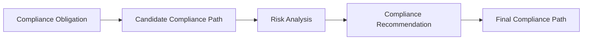

Candidate Path 僅基於法規義務與必要機制建立；Final Path 才結合實際 gap / risk / recommendation。`FinalCompliancePath` 包含 scope、steps、measures、required/conditional/recommended documents、filing/approval、alternatives、evidence、confidence、version。

每個 `CompliancePathStep` 綁 applicable regulations、requirements、responsible parties、prerequisites、required documents、evidence。Path Step 的 responsible party 使用結構化 ProjectParty relation，不保存單一自由文本名稱作 Source of Truth。

# Part 27 — Contract & Document Center

Document Center 分兩類：

- **Regulatory Requirement / Regulatory Template**：由 Final Path 與 rule/metadata 決定；優先級最高；
- **Enterprise Contract Template**：企業偏好 / optional implementation，不能覆蓋監管要求。

流程：

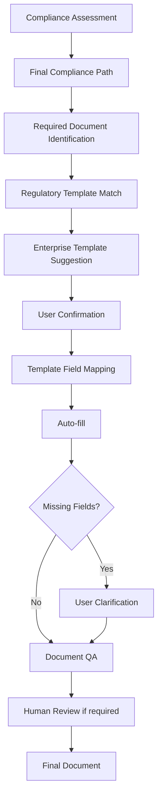

禁止 Template-specific Python if/else。具體文件類型（例如任何法域的標準合同、評估、備案、申報）由 Metadata / Rule / Template 驅動，不能新增一個文件名就新增一個 Python Skill。

Contract Review：Parsing → Clause Segmentation → Contract Type/Jurisdiction → Template Match → Clause Comparison → Compliance Rule → Missing/Risk Clause → Regulation Check → Deviation → Recommendation → Human Review。

# Part 28 — Visualization Architecture

V3.6 將 Visualization 提升為 Product / API / Frontend Coding Gate。唯一正式生成路徑：

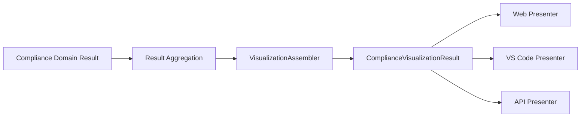

`VisualizationAssembler` 只能消費 structured domain IDs/results；不能查 LLM Narrative 做二次法律推理。Visualization 是 derived projection，不是 legal source of truth。

必須同時覆蓋：Workflow Stepper、KPI/Summary、Data Transfer Map/Route/Topology、Risk Visualization、Compliance Path Visualization、Data Item Table、Evidence/Legal Basis Drawer。

# Part 28A — AnalysisStageResult / Workflow Stepper Contract

`AnalysisStageResult` 是對外五階段的正式業務結果，不是前端假進度。

核心欄位：`stage_result_id, project_id, analysis_run_id, stage_code, stage_name, stage_sequence, status, started_at, completed_at, duration_ms, summary, key_findings, statistics, related_*_ids, evidence_ids, confidence, review_required, warning_codes, error_code`。

五個 stable stage codes：

1. `REQUIREMENT_SCENARIO_IDENTIFICATION`
2. `DATA_CLASSIFICATION`
3. `RISK_ANALYSIS`
4. `COMPLIANCE_RECOMMENDATION`
5. `COMPLIANCE_PATH`

Stage status 由 `WorkflowStageAggregator` 消費 Canonical WorkflowEvent / workflow node run，依 mapping config 聚合。Frontend 只讀 `AnalysisStageResult` / `WorkflowStageView`。

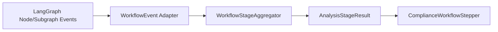

不得展示 chain-of-thought、hidden prompt、model reasoning tokens。

# Part 28B — Stage1ComplianceResult / LegalBasisItem Contract

`Stage1ComplianceResult` 是 Web / VS Code / Third-party API 的共同 Canonical Domain Result：

```text
project_id
analysis_run_id
analysis_snapshot_id
project_summary
document_analysis_summary
stage_results[]
data_item_results[]
data_flow_results[]
cross_border_results[]          # V3.6 Phase 0 normalization: explicit field
jurisdiction_results[]
risk_summary
recommendation_summary
final_compliance_path
required_documents[]
legal_basis_items[]
evidence_summary
visualization
review_status
generated_at
version
```

> **Normalization**：Master 43.1 的列舉未顯式寫 `cross_border_results`，但 V3.6 Stage 1 強制要求包含 Cross-border Results；Phase 0 將其正式加入 Canonical DTO，避免把跨境結論隱藏在 `data_flow_results` 中。

`LegalBasisItem`：legal_basis_id、jurisdiction、regulation + version、regulator、article/section、requirement、rule hit(s)、summary、applicability reason、official source/url、effective date、evidence、citation locator、original language、confidence、validation status。

建議將 `rule_hit_id` 在 API Contract 中正規化為 `rule_hit_ids[]`，Persistence 採 link table，以支援同一 Legal Basis 對應多個 Rule Hit。

# Part 28C — H5 Mandatory Result Page Composition

Desktop baseline：

```text
┌──────────────────────────────────────────────────────────────┐
│ ComplianceWorkflowStepper                                   │
├──────────────────────────────────────────────────────────────┤
│ KPI / AnalysisSummaryCards                                  │
├──────────────────────────────────────────────────────────────┤
│ Data Transfer Map / Route / Topology                         │
├─────────────────────────────┬────────────────────────────────┤
│ Risk Visualization          │ Compliance Path Visualization  │
├─────────────────────────────┴────────────────────────────────┤
│ Data Item Compliance Table                                  │
└──────────────────────────────────────────────────────────────┘
                         [Right Insight Drawer]
              Evidence / Legal Basis / Source Trace
```

Responsive / Embed 可重排，但不能刪除核心能力。`VISUALIZATION_ONLY` 可隱藏非必要 shell，但仍需支持相同 visualization DTO / drill-down。

# Part 28D — Data Transfer Map / Route / Topology Interaction Contract

至少支持：Map、Route、Topology 三種 view capability；具體是否可切換由 `available_views` 決定。

`VisualizationNode`：node type、jurisdiction/country、party/system/product refs、risk、compliance status、item/flow counts、localization/filing/approval、tooltip、related item/flow/evidence IDs。

`VisualizationEdge`：source/target、path type、flow IDs、item count、classification summary、cross-border status、reason codes、risk level、measures、documents、legal basis IDs、evidence IDs。

點擊 Node / Edge 必須 drill-down 至 Data Item、Classification、Conclusion、Legal Basis、Rule Hit、Risk、Recommendation、Path、Required Document、Evidence。

**Geolocation policy**：`latitude/longitude` 為 nullable；增加 `location_precision = EXACT | REGION | COUNTRY | UNKNOWN`。只能使用 canonical jurisdiction metadata / approved geocoding；不得由 LLM 虛構精確坐標。

# Part 28E — Risk Visualization / Compliance Status Semantic Contract

兩套獨立語義：

- Edge Color/Pattern → Compliance Status（direct / conditional / blocked_or_localized / review）；
- Node Border/Badge/Risk Layer → Risk Level（low / medium / high / critical）。

不得映射 `conditional = high risk` 或 `high risk = blocked`。Accessibility 要求：顏色之外同時使用 icon + text label + tooltip + legend；status/risk token 由 Design Token 定義。

Risk Visualization 支持 distribution、by item/flow/jurisdiction/category、risk detail drill-down。每個 Risk mark 綁 `risk_item_id + rule_hit_ids + evidence_ids + recommendation_ids`。

# Part 28F — Compliance Path Timeline / Flow Visualization Contract

Compliance Path 必須有 Timeline / Directed Flow / Stepper Flow 至少一種主交互視圖；不能只用文字 List。

每個 Path Step 顯示 sequence、name、description、jurisdiction、regulation、requirement、responsible party、prerequisites、measures、documents、filing/approval、status、evidence。

點擊 Path Step → Trigger Data Items / Data Flows / Regulation Article / Requirement / Responsible Party / Required Documents / Evidence / Current Status。

# Part 28G — Data Item Traceability / Evidence Drawer Contract

每個 Data Item 必須可回溯：

```mermaid
flowchart LR
  Src[Original Document\nPage/Section/Table/Row] --> Item[Data Item]
  Item --> Class[Classification Result]
  Class --> Flow[Data Flow]
  Flow --> CB[Cross-border Result]
  CB --> LB[Legal Basis / Rule Hit]
  LB --> Risk[Risk]
  Risk --> Rec[Recommendation]
  Rec --> Path[Compliance Path]
  Path --> Doc[Required Document]
  Doc --> Ev[Evidence]
```

`SourceTraceRef` 應為 array，以支援同一 data item 來自多文檔 / 多表格證據：document_id、version_id、page/slide/sheet、section、table、row/cell range、bbox/anchor、original text hash。

Drawer 明確區分：

- Official / Approved Evidence；
- AI Interpretation（summary/explanation/recommendation narrative）。

AI Interpretation 不得標記為 official evidence。

# Part 28H — Cross-channel Visualization / Export Contract

Web：完整互動視圖；VS Code：stage/data/risk/path compact summary + `Open Visualization` deep link；Third-party API：Canonical JSON + Stage1 result + visualization DTO + authorized deep/embed link。

Export 至少：Print-friendly H5、PDF、Image/Snapshot、Structured JSON；可選 DOCX/PPTX。Export 必須保留 workflow summary、KPI、data transfer visual、risk summary、compliance path、data item table、legal basis/evidence refs。

Export pipeline 只能 render existing DTO，不重新計算 legal result。

# Part 29 — Knowledge Operations / Admin

H5 後台管理 Jurisdiction / Scenario / Product taxonomy / Regulation / Case / Country Solution / Product Knowledge / Regulatory & Enterprise Template / Rule / Prompt / Model / Skill / Country Config / Review / Publish / Reindex / Embedding / Monitoring。

生命週期：DRAFT → PENDING_REVIEW → APPROVED → ACTIVE → SUPERSEDED/EXPIRED → ARCHIVED。Runtime 只讀 ACTIVE / snapshot-approved versions。

Publish 後 `RegistrySyncService` 刷新 registry/cache，不要求 restart core service。Registry = capability discovery；DB = runtime configuration；不得雙重保存同一業務資料。

# Part 29A — LLM Wiki Governance / Regulatory Monitoring / Impact Analysis

Regulatory Monitoring Contract：`RegulationSource / SourceEndpoint / ChangeEvent / VersionCandidate / VersionDiff / MonitoringRun / AffectedProjectImpact`。

```mermaid
flowchart LR
  S[Official / Approved Source] --> Mon[Monitor / Manual Import]
  Mon --> Detect[Change Detection]
  Detect --> Cand[Version Candidate]
  Cand --> Diff[Structure / Article Diff]
  Diff --> Review[Professional Review]
  Review --> Pub[Publish New Version]
  Pub --> Update[Knowledge / Rule / Graph Update]
  Update --> Impact[Affected Project Impact]
```

MVP 可只做 Manual Import + Version Diff + Impact Analysis；自動抓取 optional，必須 Controlled Downloader + SSRF protection + source hash + review gate。

# Part 30 — LLM Gateway / Multi-provider Foundation

統一依賴：

```text
Agent / Skill / Application Use Case
↓
LLMServicePort
↓
LLMInvocationPolicy + ModelUsagePolicy
↓
ModelRouter
↓
ProviderAdapter
```

能力標籤：TEXT、VISION、STRUCTURED_OUTPUT、LONG_CONTEXT、EMBEDDING、RERANK。

接口：chat、chat_stream、structured_output、embedding、rerank、count_tokens、health_check。Agent / Skill 不得寫 provider name / API URL / secret；Provider / Model 是 governance metadata。

ModelRouter 綜合：capability、ModelUsagePolicy、tenant/project policy、user requested eligible preference、cost/latency policy、availability、data residency、provider trust。Provider fallback 不能突破 policy。

支持多 Provider instance / 多 API endpoint / 每 Provider 多 Model；產品 UI 可提供 OpenAI/GPT、DeepSeek、Qwen、GLM 等 preset，但底層仍以 protocol + metadata 為準，不得在 legal/business routing hardcode vendor。

# Part 30A — ModelUsagePolicy / DataRedaction / Vision Capability

正式 external call pipeline：

```mermaid
flowchart LR
  Ctx[Prompt / Context Refs] --> Invoke[LLMInvocationPolicy]
  Invoke -->|NO_LLM| Core[Deterministic / Retrieval / Rule Flow]
  Invoke -->|LLM_REQUIRED| Policy[ModelUsagePolicyService]
  Policy -->|INTERNAL_ONLY| Internal[Internal Model]
  Policy -->|EXTERNAL_ALLOWED| Router[ModelRouter]
  Policy -->|REDACTION_REQUIRED| Redact[DataRedactionService]
  Redact --> Validate[Policy Validation]
  Validate --> Router
  Router --> Provider[Provider Adapter]
```